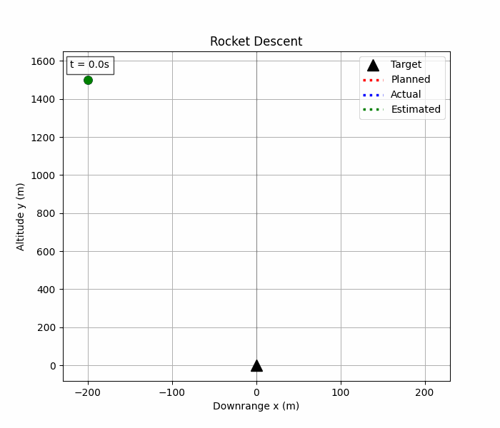
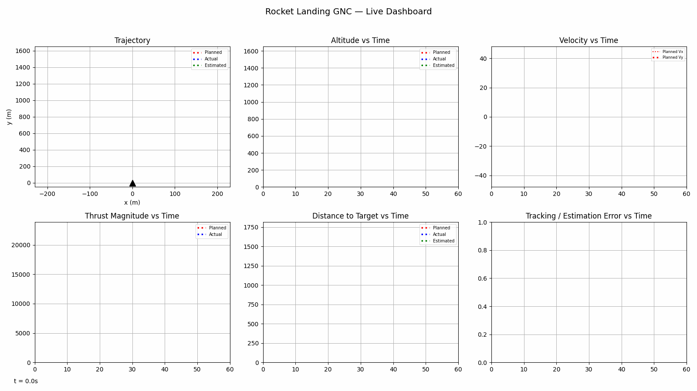

# SoftTouch GNC

3-DOF simulation of Falcon-9-style powered descent using convex optimization guidance, LQR closed-loop tracking control, and Kalman state estimation under sensor noise and wind disturbance.

 

---

## Demo



**Landing accuracy:** `3.20 m` &nbsp;|&nbsp; **Fuel used vs. planned:** `410.2 kg vs 407.1 kg (+0.8%)` &nbsp;|&nbsp; **Max tracking error under wind gust:** `24.43 m`

Full dashboard (trajectory + altitude + velocity + thrust + mass, planned vs. true vs. estimated):



---

## Problem Statement

A rocket booster descends from altitude with significant downrange offset and vertical velocity, and must reach a soft, pinpoint landing at a target pad while minimizing propellant consumption, subject to hard thrust limits (an engine that cannot throttle to zero, and cannot exceed max thrust).

Modeled as: **3-DOF, planar (x-y), point-mass, variable-mass** — no attitude/rotation dynamics, thrust vector applied directly at the center of mass.

This is a compact version of the guidance-and-control problem SpaceX solves operationally on every Falcon 9 first stage landing: fuel optimal trajectory planning under hard thrust constraints, tracked in closed loop against real-world disturbances and sensor noise.

## Why This Matters

The guidance layer here mirrors **Lossless Convexification** (Açıkmeşe & Blackmore, 2007+), the technique developed for real-time powered-descent guidance that reformulates the non-convex minimum-fuel landing problem into a convex second-order cone program that solves reliably and fast enough to run onboard. That reformulation is the core technical idea implemented in `src/optimiser.py`.

## System Architecture

Three-layer pipeline, each layer owning a distinct responsibility and handing off a clean interface to the next:

**Guidance → Control → Dynamics/Simulation**

- **Guidance** (`src/optimiser.py`) solves a convex fuel-minimal trajectory optimization problem once, offline, producing a reference state/control trajectory from initial conditions to the landing target.
- **Control** (`src/controls.py`) tracks that reference trajectory in closed loop, computing a corrective thrust command at every timestep from the deviation between reference and (estimated) actual state.
- **Dynamics** (`src/dynamics.py`) propagates the true rocket state forward under the commanded thrust plus any external disturbance (wind), via RK4 integration of the nonlinear equations of motion.
- **Estimation** (`src/kalman.py`) sits between Dynamics and Control in the closed loop: it takes noisy sensor readings of the true state and produces the filtered state estimate that Control actually acts on.

## Results

| Metric | Value |
|---|---|
| Landing accuracy (true, from target) | 3.20 m |
| Planned fuel use | 407.1 kg (of 500.0 kg available) |
| Actual fuel use | 410.2 kg (+3.0 kg vs. planned) |
| Max tracking error during flight (wind gust, steps 40–60) | 24.43 m |
| Final Kalman x-estimation error (unobserved) | 3.10 m |
| Final Kalman y-estimation error (observed) | 0.09 m |
| Max Kalman x-estimation error over flight | 3.10 m |
| Max Kalman y-estimation error over flight | 0.80 m |
| Kalman std at landing | std_x = 94.41 m, std_y = 0.36 m |
| Guidance convergence | 3 iterations (successive convexification), status = optimal |

**Caveat on the fuel comparison:** the sign of "actual vs. planned" fuel isn't a reliable efficiency signal on its own, because the closed-loop run doesn't guarantee it reaches the same terminal state the planned trajectory is optimized for (position **and** velocity both driven exactly to zero at the target). Under a strong wind gust, actual fuel came in *higher* than planned (`410.2 kg vs. 407.1 kg, +3.0 kg`) — the controller genuinely spent extra propellant fighting the disturbance, which is the expected direction. But it still landed `3.20 m` off-target with `0.45 m/s` of residual speed, not a clean zero-velocity touchdown — so even this "more expensive" landing is still an *incomplete* one relative to the plan, not a fair apples-to-apples comparison. With a weaker gust, the same architecture has produced the opposite sign (actual *lower* than planned) simply because a smaller disturbance left it closer to — but still short of — the exact terminal state, skipping less of the final braking burn but still skipping some of it. Either direction traces back to the same root cause. See **Limitations & Next Steps** below for why, and what fixes it properly.


## Tech Stack

- **Language:** Python 3.13
- **Convex optimization:** [CVXPY](https://www.cvxpy.org/) with the CLARABEL solver
- **Numerics:** NumPy, SciPy (continuous-time Riccati solver for LQR)
- **Plotting/animation:** Matplotlib, Pillow
- **Testing:** pytest

## How to Run

```bash
pip install -r requirement.txt
python main.py
```

Console output prints guidance solver status, fuel-use comparison, tracking/estimation error summary. Plots pop up interactively; animations are written to `results/animate/`.

Run tests: `pytest tests/`

## Limitations & Next Steps

What a production landing GNC stack would need beyond this prototype:

- **3-DOF only, no attitude dynamics.** No rotation, no gimbal/torque model, no angular rate control — thrust is applied as a free vector at the center of mass instead of through a physically constrained engine gimbal.
- **No 6-DOF rigid-body coupling.** Real vehicles couple translational and rotational dynamics; this sim treats them as fully decoupled by omission.
- **Idealized sensor model.** Gaussian noise only, no bias/drift, no sensor dropout or latency, no GPS/radar altimeter fusion beyond the single altimeter channel.
- **Downrange position is unobservable.** With altitude-only measurement, `x` estimation drifts unbounded over long flights — a real system would add a second position-observing sensor (e.g., radar, lidar, or GPS).
- **Linearized control around a nominal, not gain-scheduled or robust.** LQR is re-linearized each step from current mass only; no robustness margin analysis, no handling of actuator dynamics/delay.
- **Guidance solves once, offline — no replanning in flight.** Guidance computes one fixed reference trajectory before launch; LQR only tracks it, never recomputes it. When wind pushes the vehicle off track, the controller fights back with whatever thrust and altitude remain, and horizontal correction competes with vertical braking for the same capped thrust budget — so disturbed flights can land off-target and still moving. Gain tuning shifts priority between axes but can't invent a new optimal path from wherever the wind left it.

  **Real fix:** receding-horizon (MPC-style) replanning — re-solve the convex guidance problem every 1-5s from the current estimated state, so disturbances get absorbed into a fresh optimal trajectory instead of just chased by feedback.
- **Fixed final time.** The guidance horizon (`N`, `dt`) is set a priori rather than solved for as a free variable (minimum-time or minimum-fuel-with-free-time formulations).

## Repo Structure

```
.
├── main.py                    # entry point: runs guidance -> closed-loop sim -> plots/animations
├── config/
│   └── parameters.py          # all physical/sim constants (mass, thrust limits, noise, etc.)
├── src/
│   ├── dynamics.py            # equations of motion, RK4 integration, open/closed-loop sim
│   ├── optimiser.py           # convex trajectory guidance (lossless convexification)
│   ├── controls.py            # LQR tracking controller
│   ├── kalman.py              # Kalman filter + sensor noise model
│   ├── visualisation.py       # static plots (trajectory, velocity, thrust, error, etc.)
│   └── animate.py             # GIF animations (trajectory, dashboard)
├── tests/                     # pytest unit tests per module
├── results/
│   └── animate/                # trajectory.gif, dashboard.gif
├── requirement.txt
└── pyproject.toml
```

## License / Author / Contact

**Author:** Niteesh Bharadwaj
**License:** [MIT](LICENSE)
**Contact:** `PLACEHOLDER`
