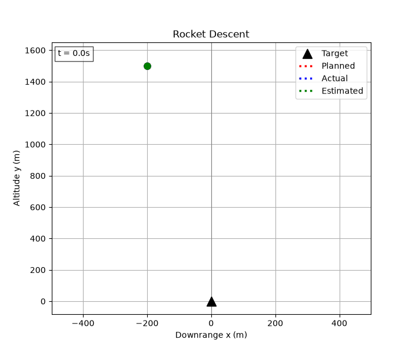
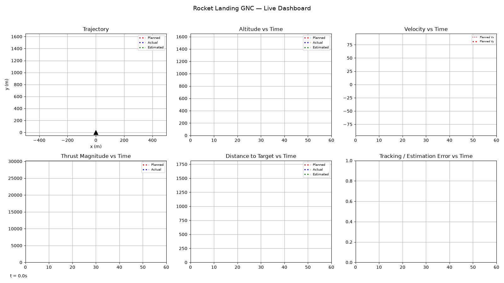

# SoftTouch GNC

3-DOF simulation of Falcon-9-style powered descent using convex optimization guidance, LQR closed-loop tracking control, and Kalman state estimation under sensor noise and wind disturbance.

 

---

## Demo


**Landing accuracy:** `9.70 m` &nbsp;|&nbsp; **Fuel used vs. planned:** `431.6 kg vs 432.1 kg (−0.1%)` &nbsp;|&nbsp; **Max tracking error under wind gust:** `38.26 m`

Full dashboard (trajectory + altitude + velocity + thrust + mass, planned vs. true vs. estimated):


---

## Problem Statement

A rocket booster descends from altitude with significant downrange offset and lateral/vertical velocity, and must reach a soft, pinpoint landing at a target pad while minimizing propellant consumption, subject to hard thrust limits (an engine that cannot throttle to zero, and cannot exceed max thrust).

Modeled as: **3-DOF, planar (x-y), point-mass, variable-mass** — no attitude/rotation dynamics, thrust vector applied directly at the center of mass.

This is a compact version of the guidance-and-control problem SpaceX solves operationally on every Falcon 9 first-stage landing: fuel-optimal trajectory planning under hard thrust constraints, tracked in closed loop against real-world disturbances and sensor noise.

## Why This Matters

The guidance layer here mirrors **Lossless Convexification** (Açıkmeşe & Blackmore, 2007+), the technique developed for real-time powered-descent guidance that reformulates the non-convex minimum-fuel landing problem — non-convex because of the thrust lower bound and the nonlinear thrust-magnitude constraint — into a convex second-order cone program that solves reliably and fast enough to run onboard. That reformulation is the core technical idea implemented in `src/optimiser.py`, not just "call a solver and hope."

## System Architecture

Three-layer pipeline, each layer owning a distinct responsibility and handing off a clean interface to the next:

**Guidance → Control → Dynamics/Simulation**

- **Guidance** (`src/optimiser.py`) solves a convex fuel-minimal trajectory optimization problem once, offline, producing a reference state/control trajectory from initial conditions to the landing target.
- **Control** (`src/controls.py`) tracks that reference trajectory in closed loop, computing a corrective thrust command at every timestep from the deviation between reference and (estimated) actual state.
- **Dynamics** (`src/dynamics.py`) propagates the true rocket state forward under the commanded thrust plus any external disturbance (wind), via RK4 integration of the nonlinear equations of motion.
- **Estimation** (`src/kalman.py`) sits between Dynamics and Control in the closed loop: it takes noisy sensor readings of the true state and produces the filtered state estimate that Control actually acts on.

## Methodology

### Dynamics (`src/dynamics.py`)
State vector `[x, y, vx, vy, m]` — downrange position, altitude, downrange velocity, vertical velocity, vehicle mass. Control input is thrust vector `[Tx, Ty]`. Equations of motion:

```
ẋ  = vx
ẏ  = vy
v̇x = Tx / m
v̇y = Ty / m − g
ṁ  = −‖T‖ / (Isp · g0)          (propellant mass flow via the rocket equation)
```

Integrated with 4th-order Runge-Kutta (RK4). Mass is floored at `DRY_MASS`; once fuel is exhausted, thrust is forced to zero.

### Guidance (`src/optimiser.py`)
The true minimum-fuel landing problem is non-convex, because the thrust-magnitude constraint `‖T‖ ≤ T_max` combined with a **lower** bound `‖T‖ ≥ T_min` (engines can't throttle to zero) is not a convex set. The key technical idea — **lossless convexification** — introduces a slack variable `Γ` for thrust magnitude, replaces `‖T‖ = Γ` with the relaxed second-order cone constraint `‖T‖ ≤ Γ`, and bounds `Γ` between `T_min` and `T_max` instead of bounding `‖T‖` directly. Açıkmeşe's result shows the relaxed problem's optimal solution satisfies `‖T‖ = Γ` exactly (active at the boundary), so nothing is lost — hence "lossless."

- **Discretization:** fixed-final-time, zero-order-hold Euler discretization over `N` steps (`N=120`, `dt=0.5s` by default — 60s horizon).
- **Cost function:** maximize final mass `m[N]`, equivalent to minimizing total fuel burned.
- **Constraints:** initial state, terminal soft-landing state (position + zero velocity), ground constraint (`y ≥ 0`), dry-mass floor, and the SOC thrust-bound constraint per timestep.
- **Nonlinear coupling:** the dynamics constraint `v̇ = T/m` divides by the mass variable, which is itself an optimization variable — this is handled via **successive convexification**: the mass trajectory is initialized from a rough burn-rate estimate, the convex subproblem is solved with that trajectory held as a fixed nominal, and the solve is repeated (up to `max_iters=3`) using the newly solved mass profile as the next nominal, until the mass trajectory converges (`< tol` change).
- **Solver:** CVXPY with the CLARABEL interior-point SOCP solver.

### Control (`src/controls.py`)
Closed-loop tracking is done with a **Linear-Quadratic Regulator (LQR)**, not a PID loop. At each step the position/velocity dynamics are linearized about the current mass (`A`, `B` matrices for the double-integrator `[x,y,vx,vy]` system), the continuous-time algebraic Riccati equation is solved for that mass to get gain `K`, and the correction `K · (planned_state − actual_state)` is added on top of the feedforward planned thrust from Guidance. The corrected command is then clipped to `[T_min, T_max]`. Recomputing `K` from the current mass at every step means the gain adapts as the vehicle burns propellant.

Disturbance rejection is tested by injecting a constant horizontal wind force (`3000 N`) over a fixed window of the descent (`main.py`), applied to the true dynamics but invisible to the controller's plant model — the controller only sees it indirectly through the resulting state error.

### State Estimation (`src/kalman.py`)
A linear Kalman filter estimates `[x, y, vx, vy]` from two noisy sensors: an accelerometer (measures specific force, used in the predict step with gravity added back explicitly since accelerometers don't sense gravity) and an altimeter (measures `y` only, used in the update step). Because only altitude is directly observed, downrange position `x` is **unobservable** in this sensor configuration — the filter's `x`-estimate can drift over long flights, which is intentional/expected and is called out in the console output (`main.py` prints x-error as "unobserved — expect large/drifting" vs. y-error "observed — expect small"). Sensor noise is Gaussian, configured via `ALTIMETER_NOISE_STD` and `ACCELEROMETER_NOISE_STD` in `config/parameters.py`.

## Results

| Metric | Value |
|---|---|
| Landing accuracy (true, from target) | 9.70 m |
| Planned fuel use | 432.1 kg (of 500.0 kg available) |
| Actual fuel use | 431.6 kg (−0.6 kg vs. planned) |
| Max tracking error during flight (wind gust, steps 40–60) | 38.26 m |
| Final Kalman x-estimation error (unobserved) | 9.52 m |
| Final Kalman y-estimation error (observed) | 0.06 m |
| Max Kalman x-estimation error over flight | 12.40 m |
| Max Kalman y-estimation error over flight | 0.78 m |
| Kalman std at landing | std_x = 94.41 m, std_y = 0.36 m |
| Guidance convergence | 3 iterations (successive convexification), status = optimal |
| Guidance solve time | `PLACEHOLDER s` — not currently logged; wrap `optimizer.solve(...)` in `main.py` with `time.perf_counter()` to capture it |

**Caveat on the fuel comparison:** actual fuel use can come in *lower* than planned, and that is not necessarily a sign of a more efficient landing. The planned trajectory is fuel-optimal for hitting an exact terminal state — position **and** velocity both driven to zero, precisely at the target. The closed-loop run doesn't guarantee it reaches that same terminal state: under wind and Kalman estimation error, it can touch down a few meters off-target and still carrying nonzero velocity (e.g. `x=-3.01 m, y=0.40 m, speed=0.43 m/s` in one run). Landing short of that precise soft-landing condition means it skipped part of the final braking burn the optimal plan pays for — which shows up as "less fuel," but is really an incomplete landing, not a more efficient one. See **Limitations & Next Steps** below for why, and what fixes it properly.

Plots (trajectory, altitude, velocity, thrust, mass, tracking error, estimation error) are generated by `main.py` via `src/visualisation.py` and displayed interactively (matplotlib `Qt5Agg` backend) — they are not currently auto-saved to disk.

<!-- PLACEHOLDER: if you add plt.savefig() calls to visualisation.py, embed the saved images here, e.g.: -->
<!--  -->

Animations (saved to `results/animate/`):




## Tech Stack

- **Language:** Python 3.13
- **Convex optimization:** [CVXPY](https://www.cvxpy.org/) with the CLARABEL solver
- **Numerics:** NumPy, SciPy (continuous-time Riccati solver for LQR)
- **Plotting/animation:** Matplotlib, Pillow
- **Testing:** pytest

## How to Run

```bash
pip install -r requirement.txt
python main.py
```

Console output prints guidance solver status, fuel-use comparison, tracking/estimation error summary. Plots pop up interactively; animations are written to `results/animate/`.

Run tests: `pytest tests/`

## Limitations & Next Steps

What a production landing GNC stack would need beyond this prototype:

- **3-DOF only, no attitude dynamics.** No rotation, no gimbal/torque model, no angular rate control — thrust is applied as a free vector at the center of mass instead of through a physically constrained engine gimbal.
- **No 6-DOF rigid-body coupling.** Real vehicles couple translational and rotational dynamics; this sim treats them as fully decoupled by omission.
- **Idealized sensor model.** Gaussian noise only, no bias/drift, no sensor dropout or latency, no GPS/radar altimeter fusion beyond the single altimeter channel.
- **Downrange position is unobservable.** With altitude-only measurement, `x` estimation drifts unbounded over long flights — a real system would add a second position-observing sensor (e.g., radar, lidar, or GPS).
- **Linearized control around a nominal, not gain-scheduled or robust.** LQR is re-linearized each step from current mass only; no robustness margin analysis, no handling of actuator dynamics/delay.
- **Guidance solves once, offline — no replanning in flight.** This is the root cause of the fuel-comparison caveat above. Guidance computes one fixed reference trajectory before the flight starts; Control (LQR) only *tracks* that fixed reference, it never recomputes it. So when wind pushes the vehicle off the reference, the controller has to close the gap using whatever thrust and altitude remain against a stale plan — and thrust is a single shared vector with a hard magnitude cap, so correcting horizontal drift competes directly with vertical braking for the same limited budget. If the disturbance leaves too little time/altitude margin, the vehicle reaches the ground still off-target and still moving, which is exactly what produces the "cheaper" but incomplete landings above. Retuning the LQR's cost weights (`Q` in `src/controls.py`) can shift priority between axes, but it can't fully fix this — it's a tracking controller, not a planner, and no amount of gain tuning lets it invent a new optimal path from wherever the wind actually left it.

  **Real fix — receding-horizon (MPC-style) replanning.** This is what operational systems built on lossless convexification actually do: re-solve the convex guidance problem periodically during flight (e.g. every 1-5s) using the current estimated state as the new initial condition, rather than solving once and tracking forever. Each re-solve produces a fresh fuel-optimal trajectory from *wherever the vehicle actually is* back to the exact target, so disturbances get absorbed into a new optimal plan instead of just being fought by feedback against a stale one. That's the difference between "control tries to catch up" and "guidance recalculates the best path from here" — and it's the only way to reliably guarantee convergence to the exact target under disturbance, which a pure open-loop-guidance-plus-feedback architecture (what this project currently is) cannot promise.
- **Fixed final time.** The guidance horizon (`N`, `dt`) is set a priori rather than solved for as a free variable (minimum-time or minimum-fuel-with-free-time formulations).

## Repo Structure

```
.
├── main.py                    # entry point: runs guidance -> closed-loop sim -> plots/animations
├── config/
│   └── parameters.py          # all physical/sim constants (mass, thrust limits, noise, etc.)
├── src/
│   ├── dynamics.py            # equations of motion, RK4 integration, open/closed-loop sim
│   ├── optimiser.py           # convex trajectory guidance (lossless convexification)
│   ├── controls.py            # LQR tracking controller
│   ├── kalman.py              # Kalman filter + sensor noise model
│   ├── visualisation.py       # static plots (trajectory, velocity, thrust, error, etc.)
│   └── animate.py             # GIF animations (trajectory, dashboard)
├── tests/                     # pytest unit tests per module
├── results/
│   └── animate/                # trajectory.gif, dashboard.gif
├── requirement.txt
└── pyproject.toml
```

## License / Author / Contact

**Author:** Niteesh Bharadwaj
**License:** [MIT](LICENSE)
**Contact:** `PLACEHOLDER`
